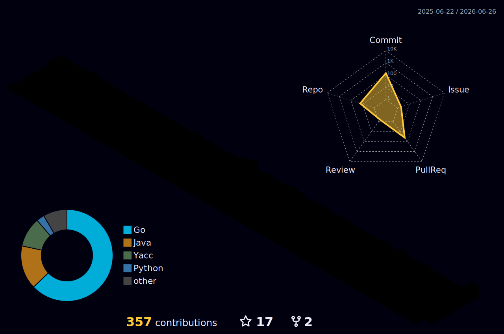

<!-- AQUI FICAM O CABEÇALHO-->

<!-- SOBRE MIM -->

<!-- SOBRE MIM -->

<!-- SOBRE MIM -->

# 👋 Olá, eu sou Vinicius Davi

---

## 👨‍💻 Sobre mim

  <h3>Desenvolvedor Back-end Java</h3>

  **Bacharel em Tecnologia da Informação (IMD/UFRN) e graduando em Engenharia de Software (UFRN). Meu objetivo é construir uma carreira sólida como Desenvolvedor Back-end Java, unindo uma base acadêmica consistente, disciplina nos estudos e dedicação ao aperfeiçoamento técnico. Tenho interesse em arquitetura de software, Programação Orientada a Objetos, bancos de dados e desenvolvimento de aplicações escaláveis, sempre buscando escrever código organizado, legível e de fácil manutenção.**

🎓 Bacharel em **Tecnologia da Informação** pelo **Instituto Metrópole Digital (IMD/UFRN)**.

🎓 Atualmente graduando em **Engenharia de Software** pela **Universidade Federal do Rio Grande do Norte (UFRN)**.

💜 Apaixonado por tecnologia e desenvolvimento Back-end.

☕ Focado em Java, Programação Orientada a Objetos, SQL e Spring Boot.

## 🚀 Principais Tecnologias do meu dia a dia

---

<h2 align="center">📚 Atualmente estudando</h2>

<table align="center">
  <tr>
    <th>Tecnologia</th>
    <th>Nível</th>
    <th>Tecnologia</th>
    <th>Nível</th>
    <th>Tecnologia</th>
    <th>Nível</th>
  </tr>
  <tr>
    <td>☕ Java</td>
    <td>██████████</td>
    <td>🧩 POO</td>
    <td>█████████░</td>
    <td>🗄️ SQL</td>
    <td>████████░░</td>
  </tr>
  <tr>
    <td>🌱 Spring Boot</td>
    <td>███████░░░</td>
    <td>🏛️ JPA</td>
    <td>██████░░░░</td>
    <td>🧪 JUnit</td>
    <td>█████░░░░░</td>
  </tr>
</table>

## 🎯 Objetivos

- Desenvolver aplicações Java escaláveis.
- Conquistar minha primeira oportunidade como Desenvolvedor Java.
- Contribuir para projetos Open Source.
- Evoluir continuamente como engenheiro de software.

---

<picture>
  <source media="(prefers-color-scheme: dark)" srcset="https://raw.githubusercontent.com/laracmiranda/laracmiranda/output/pacman-contribution-graph-dark.svg">
  <source media="(prefers-color-scheme: light)" srcset="https://raw.githubusercontent.com/laracmiranda/laracmiranda/output/pacman-contribution-graph.svg">
  
</picture>

---

> **"A consistência supera a intensidade. Cada linha de código é um passo rumo à excelência."**

# 💻 Tech Stack:
                                                

## 📊 GitHub Stats

  
  

  

## 🏆 GitHub Trophies

### ✍️ Random Dev Quote

### 🔝 Top Contributed Repo

---

<!-- Proudly created with GPRM ( https://gprm.itsvg.in ) -->

<!-- AQUI FICAM AS FERRAMENTAS E LINGUAGES QUE EU APRENDI-->

<h2 align="left"> 🛠️
<!-- AQUI FICA O GRÁFICO 3D -->

## 📈  My graph of commits

###

<!-- AQUI FICA A ANIUMAÇÃO DA COBRINHA -->

<h2 align="left"> 🐍  Animation in my commits</h2>
  
<picture align="center">
  <source media="(prefers-color-scheme: dark)" srcset="https://raw.githubusercontent.com/ViniciusProgrammer/ViniciusProgrammer/output/github-contribution-grid-snake-dark.svg">
  <source media="(prefers-color-scheme: light)" srcset="https://raw.githubusercontent.com/VinciusProgrammer/ViniciusProgrammer/output/github-contribution-grid-snake-dark.svg">
  
</picture>

###

<h2 align="left">Social Media and Contate-Me</h2>

  
  
  
  
  

###

<!-- AQUI FICA A FINALIZAÇÃO -->

<h2>💬 Reflexão</h2>
<section style="text-align: center;">
  <blockquote style="font-size: 2em; text-align: center;">
    
"A cada bug resolvido, mais perto da maestria e da glória da senioridade você está." — <strong>Vinicius Davi</strong>

  </blockquote>
</section>

