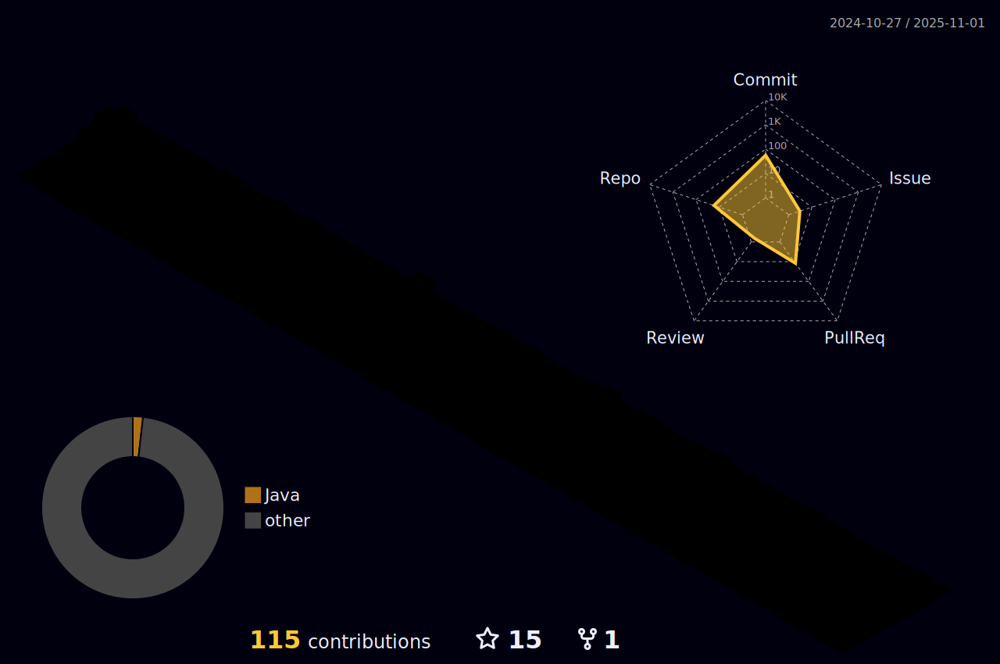

<!-- AQUI FICAM O CABEÇALHO-->

###

<!-- AQUI FICAM ASPECTOS SOBRE MIM-->

<h1 align="left">About Me 🖖</h1>

  

    
📠<strong>Estudante de Tecnologia da Informação</strong> no Instituto Metrópole Digital (IMD/UFRN), movido pela paixão de aprender, inovar e crescer no universo da tecnologia.

    <h2>💻 Áreas de Foco:</h2>
    <ul>
      <li><strong>Back-end:</strong> Desenvolvendo habilidades avançadas em <strong>Java</strong>, com ênfase no paradigma de <strong>Programação Orientada a Objetos (POO)</strong>, para criar soluções robustas e bem estruturadas.</li>
      <li><strong>Front-end:</strong> Explorando ferramentas modernas como <strong>HTML5</strong>, <strong>CSS3</strong>, <strong>JavaScript</strong> e <strong>React</strong>, com o propósito de desenvolver interfaces elegantes, funcionais e centradas no usuário.</li>
      <li>🎨 <strong>Design e Experiência do Usuário:</strong> Refinando minha expertise em <strong>Figma</strong>, projetando layouts intuitivos e visuais que conectam tecnologia e design de maneira impactante.</li>
    </ul>
    <h2>🚀 Objetivo:</h2>
    
Alavancar uma base sólida em programação e ferramentas modernas para construir projetos inovadores, eficientes e orientados à experiência do usuário. Sempre em busca de novos desafios e de um aprendizado contínuo que inspire soluções transformadoras.

  

###

<!-- AQUI FICAM AS FERRAMENTAS E LINGUAGES QUE EU APRENDI-->

<h2 align="left"> 🛠️  Tools and Languages</h2>

###

  
  
  
  
  
  
  
  
  
  
  
  
  
  
  
  
  
  
  
  
  
  
  
  
  
  
  
  

###

###

<!-- AQUI FICAM AS LINGUAGENS QUE MAIS CONTRIBUI NO GITHUB-->

## 💫 Stats
<table align="center">
   <tr border="none">
      <td width="50%" align="center">
        
          
         
      </td>
      <td width="50%" align="center">
        
      </td>
   </tr>
   
</table>

<table align="center">
<tr border="none">
<td width="50%" align="center"> 
        
      </td>
      <td width="50%" align="center">
  
  </td>
</tr>
</table>

<table align="center">
   <tr border="none">
      <td width="100%" align="center">
        
     </td>
   </tr>
</table>

<table align="center">
   <tr border="none">
      <td width="100%" align="center">
         
      </td>
   </tr>
</table>

<!-- AQUI FICA O GRÁFICO 3D -->

## 📈  My graph of commits

###

###

###

<!-- AQUI FICA A ANIUMAÇÃO DA COBRINHA -->

<h2 align="left"> 🐍  Animation in my commits</h2>
  
<picture align="center">
  <source media="(prefers-color-scheme: dark)" srcset="https://raw.githubusercontent.com/ViniciusProgrammer/ViniciusProgrammer/output/github-contribution-grid-snake-dark.svg">
  <source media="(prefers-color-scheme: light)" srcset="https://raw.githubusercontent.com/VinciusProgrammer/ViniciusProgrammer/output/github-contribution-grid-snake-dark.svg">
  
</picture>

###

<h2 align="left">Social Media and Contate-Me</h2>

  
  
  
  
  

###

<!-- AQUI FICA A FINALIZAÇÃO -->

